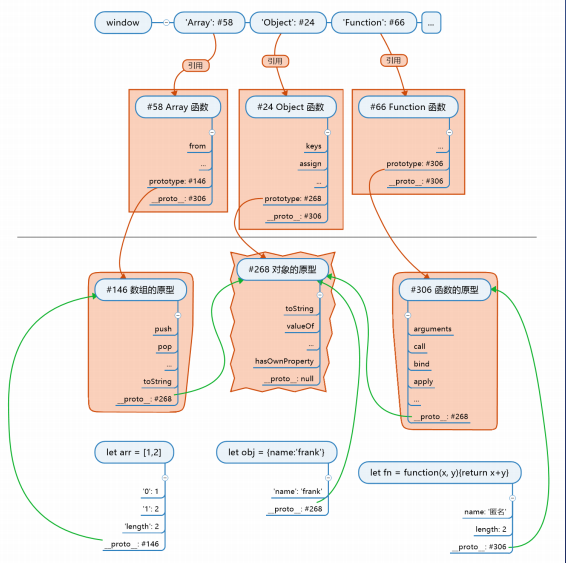

## 11-javascript3条基本原理

1. 对象.__proto__ === 其构造函数.prototype
2. 所有对象的原型(直接间接)指向Object.prototype
3. 所有函数都是由Function构造, 任意函数.__proto__ === Function.prototype

```javascript
js世界的构造顺序
1.根对象原型,__proto__ 指向null, 自身(prototype地址)#1
2.数组原型, __proto__指向#1, 自身(prototype地址)#2
3.函数的原型,__proto__指向#1, 自身(prototype地址)#3
// 说明了第二条原理
4.Function构造函数,__proto__指向#3, 自身(prototype地址)#3 
5.用Function创建Array构造函数,__proto__指向#3, 自身(prototype地址)#2
6.用Function创建Object构造函数,__proto__指向#3, 自身(prototype地址)#1
// 说明第三条原理
7.js的创建对象是没有名字的,window对象中的Function,Array,Object是对4,5,6的命名,一种引用.

new 操作符
new关键字进行了如下的操作（为了便于描述，obj用来表示创建的空对象、用constrc来表示构造函数）：
创建一个空对象obj（{}）；
将obj的[[prototype]]属性指向构造函数constrc的原型（即obj.[[prototype]] = constrc.prototype）。 
将构造函数constrc内部的this绑定到新建的对象obj，执行constrc（也就是跟调用普通函数一样，只是此时函数的this为新创建的对象obj而已，就好像执行obj.constrc()一样）；
若构造函数没有返回非原始值（即不是引用类型的值），则返回该新建的对象obj（默认会添加return this）。否则，返回引用类型的值。

8, let obj = new Object() 那么obj.__proto__ 指向#1
   let arr = new Array() arr.__proto__ 指向#2
   let obj = new Object() 那么obj.__proto__ 指向#1 
// 说明第一条原理
```

[参考文章](https://blog.csdn.net/cc18868876837/article/details/81211729)

